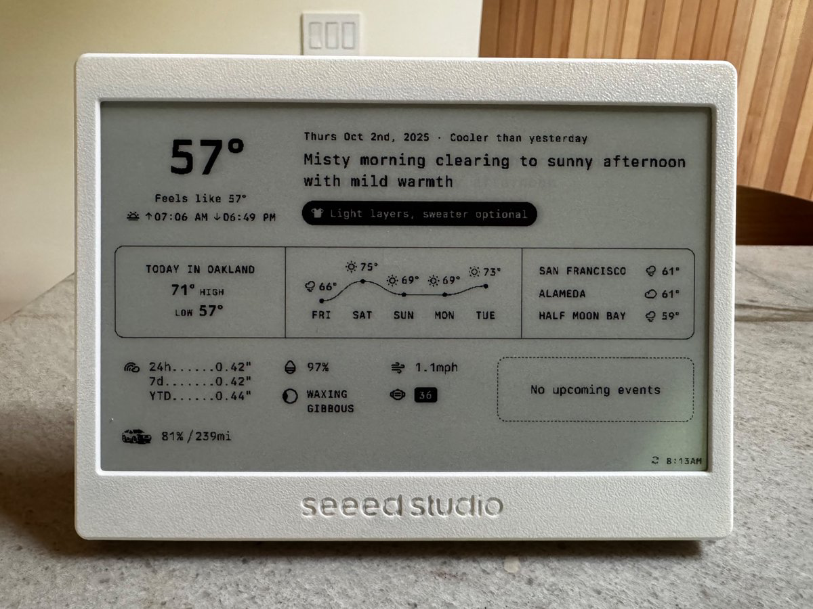

# Home Dashboard

[](https://opensource.org/licenses/MIT)
[](https://nodejs.org/)
[](https://pm2.keymetrics.io/)
[](https://github.com/kyleturman/home-dashboard)

A modular, open-source home dashboard that runs a server on a local network computer (Raspberry Pi, Mac Mini, or any always-on machine) and creates a dashboard of weather forecasts, calendar events, vehicle data, and AI insights to be shown on an e-paper display.



This [tweet](https://x.com/kyleturman/status/1973774056064516346) blew up so I thought I'd share the code and make it a bit easier and more stable to run. The code (and definitely CSS lol) is generally a little messier than I would like, and the quality of the 1-bit image conversion is not perfect with font hinting issues, but done is better than perfect and it's a home project so c'est la vie!

**How it works:** A Node.js server collects data from APIs, renders a dashboard as HTML/CSS, converts it to a 1-bit PNG image, and serves it over your local network available to a microcontroller-powered e-paper display that fetches the image and refreshes every 10 minutes (while sleeping from 12am-5am to save battery).

## Disclaimer

This project is provided **as-is** with no warranty or guarantee of support. It is not actively maintained but serves as a working example of a modular home dashboard system. Feel free to use it as a starting point for your own customizations. For development assistance, consider using [Claude Code](https://www.claude.com/product/claude-code) or other AI coding tools to extend functionality.

## Getting Started

This dashboard is designed to run as a persistent background service on an always-on computer within your local network. It uses **PM2** as a process manager to run the Node.js server as a daemon—automatically restarting on crashes and optionally starting on boot.

### Prerequisites
- **Node.js** (v16 or higher)
- **npm** (comes with Node.js)
- An always-on computer on your local network

### 1. Install Dependencies
```bash
git clone https://github.com/kyleturman/home-dashboard.git
cd home-dashboard
npm install
```

### 2. Configure Environment
```bash
cp .env.example .env
```

Edit `.env` and set at minimum:
```bash
MAIN_LOCATION_ZIP=94607
VISUAL_CROSSING_API_KEY=your_key_here
```

**Required:**
- `MAIN_LOCATION_ZIP` - Your primary 5-digit US ZIP code
- `VISUAL_CROSSING_API_KEY` - Weather forecast API key (see below)

**Optional:**
- `ADDITIONAL_LOCATION_ZIPS` - Up to 3 additional ZIP codes (comma-separated)
- `PORT` - Server port (default: 7272)
- See `.env.example` for all configuration options

### 3. Start the Server
```bash
npm start      # Start as PM2 daemon (auto-restarts on crash)
npm stop       # Stop the service
npm restart    # Restart (reloads .env)
npm run logs   # View live logs
```

The server runs on **port 7272** by default via PM2 process manager.

### 4. Enable Auto-Start on Boot (Optional)

To have the dashboard automatically start when your server reboots:

```bash
# Generate and install startup script
npx pm2 startup

# Follow the command it outputs (may require sudo)
# Then save the current PM2 process list
npx pm2 save
```

This is **highly recommended** to ensure the dashboard restarts after power loss or system updates and your display keeps on kickin'.

### 5. Access the Dashboard

**Core routes:**
- Dashboard: `http://localhost:7272/dashboard`
- E-paper 1-bit PNG image: `http://localhost:7272/dashboard/image`
- Admin panel: `http://localhost:7272/admin`

**API endpoints (used for debugging and custom development):**
- Dashboard data JSON: `http://localhost:7272/api/dashboard`
- Services status: `http://localhost:7272/api/services/status`

## API Keys & Provider Setup

### Visual Crossing Weather (Required)
Multi-location forecasts, hourly data, and astronomy information. Visual Crossing provides a free tier of 1,000 calls per day and seems the most robust and accurate of free weather APIs from my research.

1. Sign up at [visualcrossing.com/weather-api](https://www.visualcrossing.com/weather-api)
2. Free tier: 1,000 calls/day
3. Get your API key from the account dashboard
4. Add to `.env`: `VISUAL_CROSSING_API_KEY=your_key_here`

### Ambient Weather (Optional)
Have a personal weather station from [Ambient Weather](https://ambientweather.com/)? Get real-time data from your home station.

1. Own an Ambient Weather station (The [AMWS1965](https://ambientweather.com/amws1965-wifi-weather-station-with-remote-monitoring) is the most affordable starter option)
2. Create account at [ambientweather.net](https://ambientweather.net/)
3. Navigate to Account → API Keys
4. Generate Application and API keys
5. Add to `.env`:
   ```bash
   AMBIENT_APPLICATION_KEY=your_app_key
   AMBIENT_API_KEY=your_api_key
   # AMBIENT_DEVICE_MAC=optional (auto-discovers if omitted)
   ```
This will override current weather data (temperature, humidity, precipitation, etc.) from the main weather API.

### Google Calendar (Optional)
Display upcoming calendar events.

1. Go to [Google Cloud Console](https://console.cloud.google.com/)
2. Create a new project (or use existing)
3. Enable the **Google Calendar API**
4. Create **OAuth 2.0 credentials** (Web application type)
5. Add authorized redirect URI: `http://localhost:7272/auth/google/callback`
6. Download client ID and secret
7. Add to `.env`:
   ```bash
   GOOGLE_CLIENT_ID=your_client_id
   GOOGLE_CLIENT_SECRET=your_client_secret
   GOOGLE_REDIRECT_URI=http://localhost:7272/auth/google/callback # If you change the port, you must update this
   ```
8. Visit `http://localhost:7272/admin` and click "Connect Google Calendar"

### Smartcar API (Optional)
Vehicle battery/fuel level and range information for supported vehicles.

1. Sign up at [dashboard.smartcar.com](https://dashboard.smartcar.com/)
2. Create a new application
3. Add redirect URI: `http://localhost:7272/auth/smartcar/callback`
4. Note your Client ID and Secret
5. Add to `.env`:
   ```bash
   SMARTCAR_CLIENT_ID=your_client_id
   SMARTCAR_CLIENT_SECRET=your_client_secret
   SMARTCAR_REDIRECT_URI=http://localhost:7272/auth/smartcar/callback # If you change the port, you must update this
   SMARTCAR_MODE=live  # Use 'live' for real vehicle data
   ```
6. Visit `http://localhost:7272/admin` and click "Add Vehicle"

**Note:** Free tier only supports **one vehicle**.

**Custom Vehicle Logos (Optional):**

To display your vehicle brand logo:

1. Add a PNG logo to `views/assets/vehicle-logo/`
2. Name it with the lowercase brand name, replacing spaces with hyphens (e.g., `audi.png`)
3. Recommended 40x40 pixels or larger, single color
4. If no matching logo exists, the brand name will display as text

### LLM (Optional)
AI-generated daily insights and clothing suggestions, using Anthropic Claude by default (other providers can be added by modifying the `llmService.js` file, but Claude 3.5 Haiku is quite cost-effective at just a few cents per month).

1. Sign up at [console.anthropic.com](https://console.anthropic.com/)
2. Navigate to API Keys and generate a new key
3. Add to `.env`: `ANTHROPIC_API_KEY=your_api_key`

## Admin Panel

Visit `http://localhost:7272/admin` to:

- **Authenticate with Google Calendar** - One-click OAuth flow
- **Connect Smartcar** - Add vehicle via OAuth (free tier: 1 vehicle only)
- **Monitor service status** - See which APIs are working

OAuth tokens are stored in `data/auth.json` and persist across restarts.

## Developing

This project is designed to be modular and easy to customize, with each service (weather, calendar, vehicle, etc.) implemented as a separate class that is built to a single data object sent to the dashboard.

### Development Commands

```bash
# Test individual services
npm run test-service weather   # Visual Crossing API
npm run test-service ambient   # Ambient Weather Station
npm run test-service calendar  # Google Calendar
npm run test-service vehicle   # Smartcar
npm run test-service llm       # Claude AI

# Process management
npm start      # Start PM2 daemon
npm stop       # Stop daemon
npm restart    # Restart (reloads .env)
npm run logs   # View logs

# PM2 commands
npx pm2 list   # List all processes
npx pm2 monit  # Monitor resources
```

### Service Architecture

All data services extend `BaseService` (`lib/BaseService.js`) which provides:
- Automatic caching with configurable TTL
- Exponential backoff retry logic
- Stale cache fallback on API failures
- Status tracking

**Services are located in `services/`:**
- `weatherApiService.js` - Visual Crossing forecasts (required)
- `ambientService.js` - Personal weather station (optional)
- `calendarService.js` - Google Calendar (optional)
- `vehicleService.js` - Smartcar telemetry (optional)
- `llmService.js` - Claude AI insights (optional)

### Modifying Services

Services are **modular** - you can easily add, remove, or swap them:

1. **Add a new service:** Extend `BaseService` in `services/`, implement required methods
2. **Integrate data:** Add service call in `lib/dataBuilder.js`
3. **Test it:** Add to `scripts/test-service.js`
4. **Update UI:** Modify `views/dashboard.ejs` to display the data

### Modifying the Dashboard UI

**HTML/CSS changes:**
1. Edit `views/dashboard.ejs` (EJS template)
2. Edit styles in `views/styles/` (CSS files)
3. Visit `http://localhost:7272/dashboard` to preview
4. Check `http://localhost:7272/dashboard/image` for e-paper output

**No server restart needed for view changes** - just refresh the browser.

### Development Resources

- **`AGENTS.md`** - Comprehensive guide for AI-assisted development
- **`lib/state.js`** - Centralized state management (all caches in `data/state.json`)
- **`lib/dataBuilder.js`** - Data aggregation logic
- **`routes/`** - Express route handlers

## Arduino Setup (E-Paper Display)
This sketch is based on one specific hardware setup using the Seeed XIAO ESP32 series microcontrollers and 7.5" e-Paper Displays. It is not a general solution and may require modifications for other hardware.

### Hardware Requirements
- **Seeed XIAO ESP32-C3** (or similar ESP32 board)
- **7.5" e-Paper Display** (800x480 resolution)
- USB-C cable for programming
- Specifically was tested with the [XIAO 7.5" ePaper Panel](https://www.seeedstudio.com/XIAO-7-5-ePaper-Panel-p-6416.html)

### Arduino Code Location
`arduino/xiao-7.5-epaper/epaper-client.ino`

The sketch fetches the dashboard image from the server every 10 minutes and displays it on the e-paper screen.

**Important:** Your server should have a **fixed local IP address** or **local hostname** to ensure the e-paper display can reliably connect to it. If your server's IP changes (due to DHCP), the display won't be able to fetch the dashboard. You can either:
- Set a static IP in your router's DHCP settings for the server's MAC address
- Use a local hostname (e.g., `raspberrypi.local`) if your network supports mDNS/Bonjour

### Flashing Instructions

**1. Install Arduino IDE**
- Download from [arduino.cc/en/software](https://www.arduino.cc/en/software)

**2. Add ESP32 Board Support**
- Open Arduino IDE
- Go to **File → Preferences**
- Add to "Additional Boards Manager URLs":
  ```
  https://raw.githubusercontent.com/espressif/arduino-esp32/gh-pages/package_esp32_index.json
  ```
- Go to **Tools → Board → Boards Manager**
- Search for "esp32" and install **esp32 by Espressif Systems**

**3. Open the sketch**
- Open the sketch `arduino/xiao-7.5-epaper/` in Arduino IDE and ensure `driver.h` is included as well

**4. Configure WiFi and Server**
Edit the Arduino sketch and replace the placeholder values at the top of the file:
```cpp
// Replace these template values:
const char* WIFI_SSID = "{{WIFI_NAME}}";        // Your WiFi network name
const char* WIFI_PASSWORD = "{{WIFI_PASSWORD}}"; // Your WiFi password
const char* SERVER_IP = "{{SERVER_IP}}";         // Your server's local IP (e.g., "192.168.1.100")
const int SERVER_PORT = {{SERVER_PORT}};         // Your server port (default: 7272)
```

**Example:**
```cpp
const char* WIFI_SSID = "MyHomeNetwork";
const char* WIFI_PASSWORD = "mypassword123";
const char* SERVER_IP = "192.168.1.50";
const int SERVER_PORT = 7272;
```

**5. Configure Board Settings**
- **Board:** Tools → Board → ESP32 Arduino → **XIAO_ESP32C3**
- **Port:** Tools → Port → (select the usb COM port of your connected XIAO)

**6. Upload the Sketch**
- Connect XIAO ESP32-C3 via USB-C
- Click the **Upload** button (→) in Arduino IDE
- Wait for "Done uploading" message

**7. Monitor Serial Output (Optional)**
- Tools → Serial Monitor (115200 baud)
- Watch for connection status and image refresh logs

### Troubleshooting Arduino Upload

**Board not detected:**
- Try a different USB cable (must support data transfer)
- Hold the BOOT button while connecting USB
- Check Device Manager (Windows) or `ls /dev/tty.*` (macOS)

**Upload fails:**
- Lower upload speed: Tools → Upload Speed → 115200
- Press RESET button after clicking upload
- See Arduino forum or Seeed Wiki for ESP32-C3 specific issues

## License

MIT - Free to use, modify, and distribute. No warranty provided.
